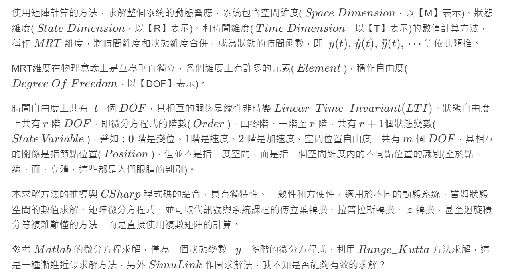
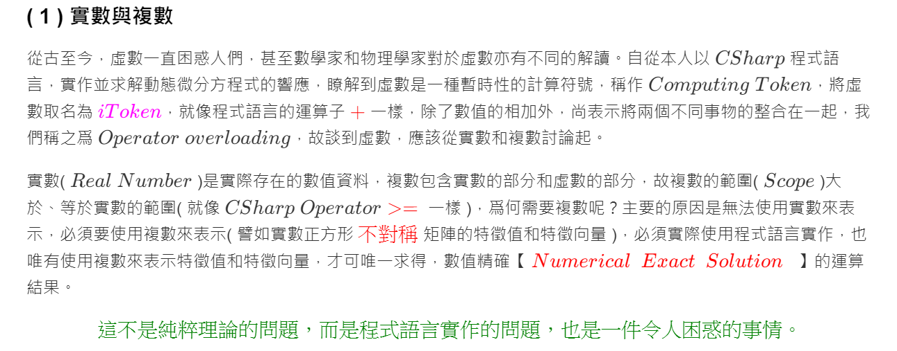
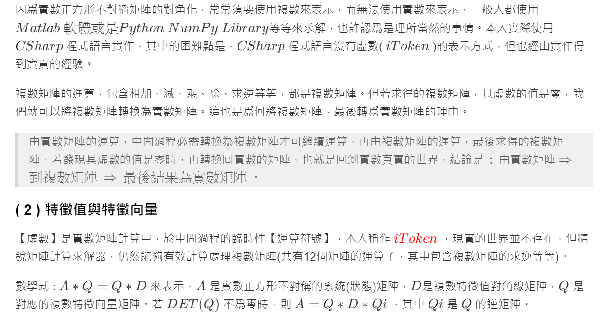
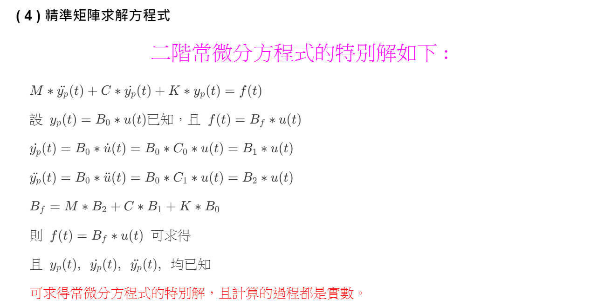
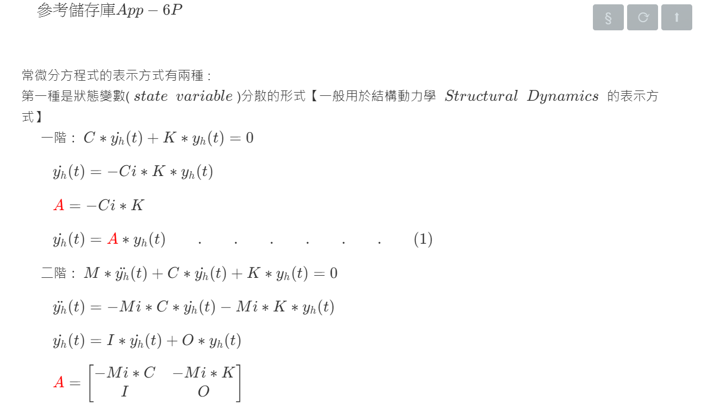
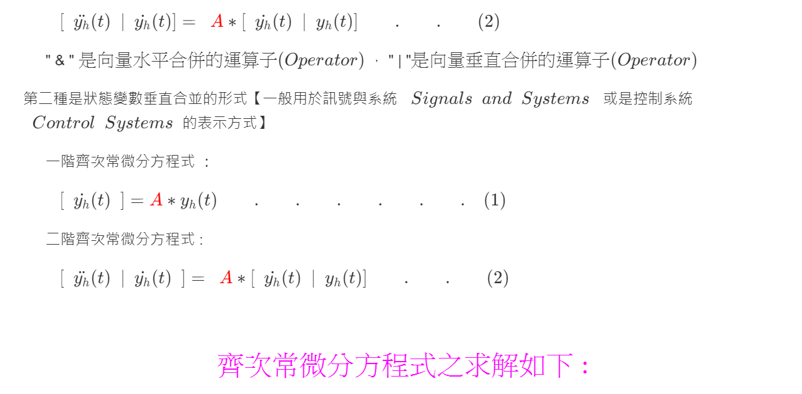
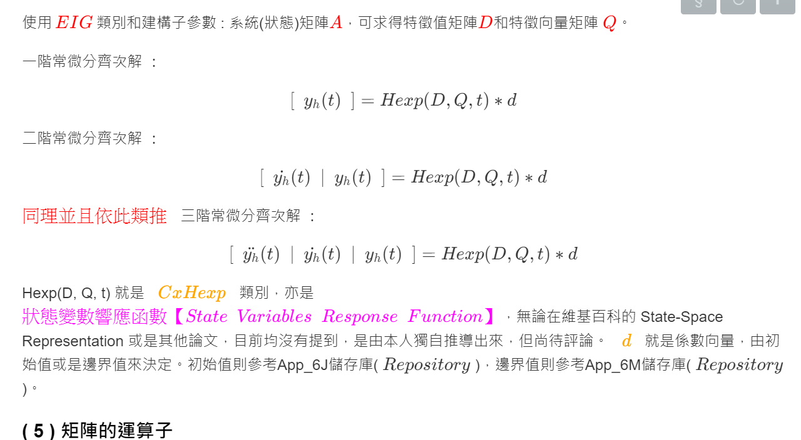
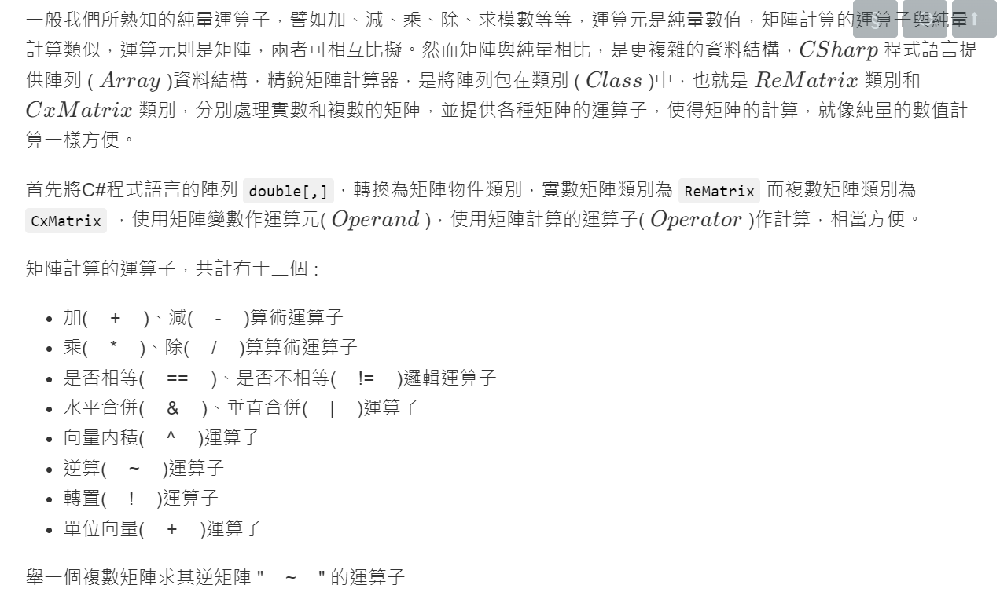

<!--    Doc_2A Documentation      --> 

  

<!-- 
# \[ {\color{red}精銳矩陣計算求解器}\]

### \[ {\color{red} (Sharp \enspace Matrix \enspace Solver, \enspace SMS)}\]
-->

  

  

  

  

<!--  
使用矩陣計算的方法，求解整個系統的動態響應，系統包含空間維度( \( Space \ Dimension \)，以【M】表示)、狀態維度( \( State \ Dimension \)，以【R】表示)、和時間維度( \( Time \ Dimension \)，以【T】表示)的數值計算方法，稱作 \( MRT \) 維度，將時間維度和狀態維度合併，成為狀態的時間函數，即 \( \ y(t), \,  \dot {y}(t), \, \ddot {y}(t), \, \cdots  \) 等依此類推。

MRT維度在物理意義上是互爲垂直獨立，各個維度上有許多的元素( \( Element \) )，稱作自由度( \( Degree \ Of \ Freedom \)，以【DOF】表示)。

時間自由度上共有\( \enspace t \enspace \) 個 \( DOF \)，其相互的關係是線性非時變 \( Linear \enspace Time \enspace Invariant(LTI) \)。狀態自由度上共有 \( r \) 階 \( DOF \)，即微分方程式的階數( \( Order \) )，由零階、一階至 \( r \) 階，共有 \( r+1 \)個狀態變數( \( State \ Variable \) )，譬如；\( 0 \) 階是變位、\( 1 \)階是速度、\( 2 \) 階是加速度。空間位置自由度上共有 \( m \) 個 \( DOF \)，其相互的關係是指節點位置( \( Position \) )，但並不是指三度空間，而是指一個空間維度内的不同點位置的識別(至於點、線、面、立體，這些都是人們眼睛的判別)。

本求解方法的推導與 \( CSharp \) 程式碼的結合，具有獨特性、一致性和方便性，適用於不同的動態系統，譬如狀態空間的數值求解、矩陣微分方程式、並可取代訊號與系統課程的傅立葉轉換、拉普拉斯轉換、 \( z \) 轉換，甚至迴旋積分等複雜難懂的方法，而是直接使用複數矩陣的計算。

參考 \( Matlab \) 的微分方程求解，僅為一個狀態變數 \( \enspace y \enspace \) 多階的微分方程式、利用 \( Runge \_ Kutta \) 方法求解，這是一種漸進近似求解方法，另外 \( SimuLink \) 作圖求解法，我不知是否能夠有效的求解？

另本人在網路上也未發現有人，直接利用系統(狀態)矩陣 \( {\color{red} A} \) ，求得複數特徵值矩陣 \( {\color{red} D} \) 和複數特徵向量矩陣 \( {\color{red}Q}  \)，再直接求解 \( {\color{red}多節點多狀態變數} \) 的微分方程式的相關論文。

> 因此大膽稱此法是，目前世界上，具有唯一性、獨特性、和一致性，直接使用矩陣常微分方程式，求解動態系統的狀態變數，適用於結構動力、控制系統、訊號與系統、和線性系統。而不使用傳統的 \( {\color {red} Fourier \quad Transform, \quad Laplace \quad Transform, \quad Z \quad Transform, \quad Convolution \quad Integer} \)等等近似的方法求解，複雜難懂，並且無法直接求解而是使用量測求得狀態變數，但本法可以直接使用數學模型求取時間軸上的各種狀態變數( State Variables )。

#### ( 1 ) 實數與複數

從古至今，虛數一直困惑人們，甚至數學家和物理學家對於虛數亦有不同的解讀。自從本人以 \( CSharp \) 程式語言，實作並求解動態微分方程式的響應，瞭解到虛數是一種暫時性的計算符號，稱作 \( Computing \ Token \)，將虛數取名為 \(   { \color{fuchsia} iToken} \)，就像程式語言的運算子 \( {\color{red}+} \) 一樣，除了數值的相加外，尚表示將兩個不同事物的整合在一起，我們稱之爲 \( Operator \ overloading \)，故談到虛數，應該從實數和複數討論起。

實數( \( Real \ Number \) )是實際存在的數值資料，複數包含實數的部分和虛數的部分，故複數的範圍( \( Scope \) )大於、等於實數的範圍( 就像 \( CSharp \ Operator { \color {red} \ >= \ } \) 一樣 )，爲何需要複數呢？主要的原因是無法使用實數來表示，必須要使用複數來表示( 譬如實數正方形 \( { \color{red}不對稱 } \) 矩陣的特徵值和特徵向量 )，必須實際使用程式語言實作，也唯有使用複數來表示特徵值和特徵向量，才可唯一求得，數值精確【 \( { \color{red} Numerical \enspace Exact \enspace Solution \enspace } \) 】的運算結果。

\[ { \color {green} 這不是純粹理論的問題，而是程式語言實作的問題，也是一件令人困惑的事情。 } \]

因爲實數正方形不對稱矩陣的對角化，常常須要使用複數來表示，而無法使用實數來表示，一般人都使用 \( Matlab \ 軟體或是Python \ NumPy \ Library \)等等來求解，也許認爲是理所當然的事情。本人實際使用 \( CSharp \) 程式語言實作，其中的困難點是，\( CSharp \) 程式語言沒有虛數( \( iToken \) )的表示方式，但也經由實作得到寶貴的經驗。

複數矩陣的運算，包含相加、減、乘、除、求逆等等，都是複數矩陣。但若求得的複數矩陣，其虛數的值是零，我們就可以將複數矩陣轉換為實數矩陣。這也是爲何將複數矩陣，最後轉爲實數矩陣的理由。

> 由實數矩陣的運算，中間過程必需轉換為複數矩陣才可繼續運算，再由複數矩陣的運算，最後求得的複數矩陣，若發現其虛數的值是零時，再轉換囘實數的矩陣，也就是回到實數真實的世界，結論是 \( \, : \, \) 由實數矩陣 \( \Rightarrow \, 到複數矩陣 \, \Rightarrow \, 最後結果為實數矩陣  \) 。

#### ( 2 ) 特徵值與特徵向量

【虛數】是實數矩陣計算中，於中間過程的臨時性【運算符號】，本人稱作 \( { \color {red} iToken } \)  ，現實的世界並不存在，但精銳矩陣計算求解器，仍然能夠有效計算處理複數矩陣(共有12個矩陣的運算子，其中包含複數矩陣的求逆等等)。

數學式 :  \( A \ast Q = Q \ast D \) 來表示，\( A \) 是實數正方形不對稱的系統(狀態)矩陣，\( D \)是複數特徵值對角線矩陣，\( Q \) 是對應的複數特徵向量矩陣。若 \( DET(Q) \) 不爲零時，則 \( A = Q \ast D \ast Qi \) ，其中 \( Qi \) 是 \( Q \) 的逆矩陣。
-->

> 以上的數學式的證明並不難，舉二個實例加以説明。

【實例一】

```CSharp
using System;
using Matrix_0; 

namespace ConsoleApp3
{
    internal class Program
    {
        static void Main(string[] args)
        {

double[,] Ap = { {4, -2, -2}, {-2, -4, 4}, {-4, 2, 8} };
ReMatrix A = new ReMatrix(Ap); 

EIG eig = new EIG(A); 
ReMatrix Q = eig.MatrixQ; 
Console.Write("\nQ : \n{0}\n", new PR(Q)); 

ReMatrix D = eig.MatrixD;
Console.Write("\nD: \n{0}\n", new PR(D));  

        }
    }
}
/*  執行結果  
Q :
  0.37030     0.20177      0.82439
 -0.29682     0.97534      0.09119
 -0.88021    -0.08948      0.55863

D:
 10.35719     0.00000      0.00000
  0.00000    -4.78071      0.00000
  0.00000     0.00000      2.42352
*/
```

【實例二】

```CSharp
using System;
using Matrix_0; 

namespace ConsoleApp3
{
    internal class Program
    {
        static void Main(string[] args)
        {

double[,] Ap = { {4, -2, 12}, {-2, -4, 4}, {-4, 2, 8} };
ReMatrix A = new ReMatrix(Ap); 

EIG eig = new EIG(A); 
CxMatrix Q = eig.CxMatrixQ; 
Console.Write("\nQ : \n{0}\n", new PR(Q)); 

CxMatrix D = eig.CxMatrixD;
Console.Write("\nD: \n{0}\n", new PR(D));  

// A = Q * D * Qi ; 複數相乘的結果雖然是複數，但其虛數值為零，
// 故轉換(cast)為實數矩陣，矩陣B與原來輸入的矩陣A相同。 
ReMatrix B = (ReMatrix)(Q * D * ~Q); 
Console.Write("\nB:\n{0}\n", new PR(B)); 

        }
    }
}
/*  執行結果  
Q :
  0.84227 +   0.00000i,   0.84227 +  0.00000i,   0.29317 +  0.00000i
  0.01280 +   0.17598i,   0.01280 -  0.17598i,   0.95435 +  0.00000i
  0.17250 +   0.47926i,   0.17250 -  0.47926i,  -0.05726 +  0.00000i
D:
  6.42719 +   6.41024i,   0.00000 +  0.00000i,   0.00000 +  0.00000i
  0.00000 +   0.00000i,   6.42719 -  6.41024i,   0.00000 +  0.00000i
  0.00000 +   0.00000i,   0.00000 +  0.00000i,  -4.85437 +  0.00000i
B:
  4.00000   -2.00000    12.00000
 -2.00000   -4.00000     4.00000
 -4.00000    2.00000     8.00000

請按任意鍵繼續 . . .
*/
```  

  

<!--  
#### ( 3 ) 維度和自由度

維度( \( Dimension，Dim \) )指的是水平方向的列( \( Row \) )，自由度( \(Degree \enspace Of \enspace  Freedom，DOF\) )指的是垂直方向的行( \( Column \) )，線性代數和矩陣計算等數學的書，所指的矩陣( \( Matrix \) )和向量( \( Vector \) )，和一般軟體所定義稍有不同，矩陣或是向量變數( \( Variable \) )，應於變數的前方宣告，舉例説明如下。  
-->

```CSharp
using System;
using Matrix_0;  

namespace ConsoleApp4
{
    internal class Program
    {
        static void Main(string[] args)
        {

double[,] A0 = { {1, 2, 3}, {2, 5, 6}, {3, 4, 3}}; 
Console.Write("\nA0 矩陣，即R mXn [R3x3] :\n{0}", new PR(A0)); 

double[,] A1 = { {1}, {2}, {3} };  
Console.Write("\nA1 行向量，也是矩陣，即[R3X1] :\n{0}", new PR(A1)); 

double[,] A2 = { {1, 2, 3} };
Console.Write("\nA2 列向量，也是矩陣，即[R1X3] :\n{0}", new PR(A2)); 

double[,] A3 = { {3} };  
Console.Write("\nA3 雖然僅有一個元素，但也是矩陣，即[R1X1] :\n{0}", new PR(A3)); 

double[] A4 = { 1, 2, 3 }; 
Console.Write("\nA4 列向量，印出結果與A2完全相同，但型態不同[R1]:\n{0}", new PR(A4));   

// ***  如何輸入複數矩陣，並設定複數矩陣變數B[C2X3]  ***  
double[,] Bre = {{4, 5, -3}, {-3, 4, 1}}; 
double[,] Bim = {{-9, 8, -4}, {2, -5, 9}}; 
CxMatrix B = new CxMatrix(Bre, Bim); 
Console.Write("\n複數矩陣變數 B [C2X3] :\n{0}\n", new PR(B)); 

        }
    }
}
/* 輸出結果 : 
A0 矩陣，即R mXn [R3x3] :
        1.00000          2.00000          3.00000
        2.00000          5.00000          6.00000
        3.00000          4.00000          3.00000
A1 行向量，也是矩陣，即[R3X1] :
        1.00000
        2.00000
        3.00000
A2 列向量，也是矩陣，即[R1X3] :
        1.00000          2.00000          3.00000
A3 雖然僅有一個元素，但也是矩陣，即[R1X1] :
        3.00000
A4 列向量，印出結果與A2完全相同，但型態不同[R1]:
        1.00000          2.00000          3.00000
複數矩陣變數 B [C2X3] :
  4.00000 -  9.00000i,   5.00000 +  8.00000i,  -3.00000 -  4.00000i
 -3.00000 +  2.00000i,   4.00000 -  5.00000i,   1.00000 +  9.00000i
請按任意鍵繼續 . . .
*/
```

  

<!--      
#### ( 4 ) 精準矩陣求解方程式

### \[ \color {fuchsia} 二階常微分方程式的特別解如下 : \]

\( \quad M \ast \ddot{y_p}(t) + C \ast \dot{y_p}(t) + K \ast y_p(t) = f(t)  \)

\( \quad 設 \enspace y_p(t) = B_0 \ast u(t) 已知，且 \enspace f(t) = B_f \ast u(t) \)

\( \quad \dot{y_p}(t) = B_0 \ast \dot{u}(t) = B_0 \ast C_0 \ast u(t) = B_1 \ast u(t) \)

\( \quad \ddot{y_p}(t) = B_0 \ast \ddot{u}(t) = B_0 \ast C_1 \ast u(t) = B_2 \ast u(t) \)

\( \quad B_f = M \ast B_2 + C \ast B_1 + K \ast B_0 \)

\( \quad 則 \enspace f(t) = B_f \ast u(t) \enspace 可求得 \)

\( \quad 且 \enspace y_p(t), \enspace \dot{y_p}(t), \enspace \ddot{y_p}(t), \enspace 均已知  \)

\( \quad { \color{red}可求得常微分方程式的特別解，且計算的過程都是實數。}  \)

-->

  

  

  

      

<!-- 
\( \quad 參考儲存庫App-6P  \)

\[ \quad  \]  

常微分方程式的表示方式有兩種 :
第一種是狀態變數( \( state \enspace variable \) )分散的形式【一般用於結構動力學\( \enspace Structural \enspace Dynamics \enspace \)的表示方式】
\( \quad \) 一階：  \( C \ast \dot{y_h}(t) + K \ast y_h(t) = 0 \)

\( \qquad \dot{y_h}(t) = - Ci \ast K \ast y_h(t) \)

\( \qquad {\color{red} A} = -Ci \ast K \)

\( \qquad \dot{y_h}(t) = {\color{red} A} \ast y_h(t) \qquad . \qquad . \qquad . \qquad . \qquad . \qquad . \qquad (1) \)

\( \quad \) 二階：  \( M \ast \ddot{y_h}(t) + C \ast \dot{y_h}(t) + K \ast y_h(t) = 0 \)

\( \qquad \ddot{y_h}(t) = -Mi \ast C \ast \dot{y_h}(t) -Mi \ast K \ast y_h(t) \)

\( \qquad \dot{y_h}(t) = I \ast \dot{y_h}(t) + O \ast y_h(t) \)

\( \qquad {\color{red} A} =
\begin{bmatrix}
-Mi \ast C & -Mi \ast K \\ I & O
\end{bmatrix} \)

\( \qquad [\enspace \ddot{y_h}(t) \enspace | \enspace \dot{y_h}(t)] =
\enspace {\color{red} A} \ast [\enspace \dot{y_h}(t) \enspace | \enspace y_h(t)] \qquad . \qquad . \qquad (2) \)

\( \quad \) " & " \( 是向量水平合併的運算子(Operator) \) ， " | "\(  是向量垂直合併的運算子(Operator) \)

第二種是狀態變數垂直合並的形式【一般用於訊號與系統 \( \enspace Signals \enspace and \enspace Systems \enspace \) 或是控制系統 \( \enspace Control \enspace Systems \enspace \)的表示方式】

\( \quad \) 一階齊次常微分方程式 ：

\( \qquad [\enspace \dot{y_h}(t) \enspace] = {\color{red} A} \ast y_h(t) \qquad . \qquad . \qquad .\qquad . \qquad . \qquad . \quad (1) \)

\( \quad \) 二階齊次常微分方程式 :

\( \qquad [\enspace \ddot{y_h}(t) \enspace | \enspace \dot{y_h}(t) \enspace ] =
\enspace {\color{red} A} \ast [\enspace \dot{y_h}(t) \enspace | \enspace y_h(t)] \qquad . \qquad . \qquad (2) \)

\[ \quad \]  

### \[ { \color {fuchsia} 齊次常微分方程式之求解如下 :} \]

使用\( \, {\color{red}EIG} \, \)類別和建構子參數 : 系統(狀態)矩陣\( {\color{red}A} \)，可求得特徵值矩陣\( {\color{red}D} \)和特徵向量矩陣 \( {\color{red}Q} \)。

一階常微分齊次解 ： \[ [ \enspace y_h(t) \enspace] = Hexp(D, Q, t) \ast d \]

二階常微分齊次解 ： \[ [ \enspace \dot{y_h}(t) \enspace | \enspace y_h(t) \enspace] = Hexp(D, Q, t) \ast d  \]

\( {\color{red} 同理並且依此類推} \enspace \) 三階常微分齊次解 ： \[ [ \enspace \ddot{y_h}(t) \enspace | \enspace \dot{y_h}(t) \enspace | \enspace y_h(t) \enspace] = Hexp(D, Q, t) \ast d \]

Hexp(D, Q, t) 就是 \( \enspace {\color{orange} CxHexp } \enspace \) 類別，亦是 \( { \color{fuchsia} 狀態變數響應函數【 State \enspace Variables \enspace Response \enspace Function 】 } \)，無論在維基百科的 State-Space Representation 或是其他論文，目前均沒有提到，是由本人獨自推導出來，但尚待評論。 \( \enspace {\color{orange} d } \enspace \) 就是係數向量，由初始值或是邊界值來決定。初始值則參考App_6J儲存庫( \( Repository \) )，邊界值則參考App_6M儲存庫( \( Repository \) )。

#### ( 5 ) 矩陣的運算子

一般我們所熟知的純量運算子，譬如加、減、乘、除、求模數等等，運算元是純量數值，矩陣計算的運算子與純量計算類似，運算元則是矩陣，兩者可相互比擬。然而矩陣與純量相比，是更複雜的資料結構，\(CSharp\) 程式語言提供陣列 ( \(Array\) )資料結構，精銳矩陣計算器，是將陣列包在類別 ( \( Class \) )中，也就是 \( ReMatrix \) 類別和 \(CxMatrix\) 類別，分別處理實數和複數的矩陣，並提供各種矩陣的運算子，使得矩陣的計算，就像純量的數值計算一樣方便。

首先將C#程式語言的陣列 `double[,]`，轉換為矩陣物件類別，實數矩陣類別為 `ReMatrix` 而複數矩陣類別為 `CxMatrix` ，使用矩陣變數作運算元( $Operand$ )，使用矩陣計算的運算子( $Operator$ )作計算，相當方便。

矩陣計算的運算子，共計有十二個 :

- 加( \(\enspace\) + \( \enspace \) )、減( \( \enspace \) - \( \enspace \) )算術運算子
- 乘( \( \enspace \) * \( \enspace \) )、除( \( \enspace \) / \( \enspace \) )算算術運算子
- 是否相等( \( \enspace \) == \( \enspace \) )、是否不相等( \( \enspace \) != \( \enspace \) )邏輯運算子
- 水平合併( \( \enspace \) & \( \enspace \) )、垂直合併( \( \enspace \) | \( \enspace \) )運算子
- 向量内積( \( \enspace \) ^ \( \enspace \) )運算子
- 逆算( \( \enspace \) ~ \( \enspace \) )運算子
- 轉置( \( \enspace \) ! \( \enspace \) )運算子
- 單位向量( \( \enspace \) + \( \enspace \) )運算子

舉一個複數矩陣求其逆矩陣 " \( \enspace \) ~ \( \enspace \) " 的運算子
-->

```CSharp
using System;
using Matrix_0; 

namespace ConsoleApp5
{
    internal class Program
    {
        static void Main(string[] args)
        {

double[,] Are = { {-3, 5, 8}, {2, -5, 9}, {6, 9, 2} };
double[,] Aim = { {-6, 7, 9}, {4, -5, -2}, {-3, 5, -4} }; 

// 建構任意C3X3的複數矩陣 A :
CxMatrix A = new CxMatrix(Are, Aim); 
Console.Write("\n複數矩陣A :\n{0}", new PR(A));  

// 建構複數矩陣A的逆矩陣 Ai ： 
CxMatrix Ai = ~A; 
Console.Write("\n複數矩陣Ai :\n{0}", new PR(Ai)); 

// 複數矩陣 B = A * Ai ， 亦即 B = A * ~A ;  
CxMatrix B = A * Ai; 
Console.Write("\n複數矩陣B :\n{0}", new PR(B)); 

// 因爲複數矩陣B的虛數部分為零，故可以轉換(cast)為實數矩陣 C ，  
// 即 Identity Matrix 。 ***  Check!  OK    ***
ReMatrix C = (ReMatrix)B; 
Console.Write("\n實數矩陣C :\n{0}\n", new PR(C)); 

        }
    }
}
/* 輸出結果 : 
複數矩陣A :
  -3.00000 -   6.00000i,   5.00000 +   7.00000i,   8.00000 +   9.00000i
   2.00000 +   4.00000i,  -5.00000 -   5.00000i,   9.00000 -   2.00000i
   6.00000 -   3.00000i,   9.00000 +   5.00000i,   2.00000 -   4.00000i
複數矩陣Ai :
  -0.02874 +   0.06505i,   0.06936 +   0.02633i,   0.08584 -   0.00831i
  -0.01739 -   0.02187i,  -0.03348 +   0.05402i,   0.05789 +   0.00493i
   0.04098 -   0.01439i,   0.06137 -   0.01162i,   0.00664 +   0.00007i
複數矩陣B :
   1.00000 +   0.00000i,   0.00000 +   0.00000i,   0.00000 +   0.00000i
   0.00000 +   0.00000i,   1.00000 +   0.00000i,   0.00000 +   0.00000i
   0.00000 +   0.00000i,   0.00000 +   0.00000i,   1.00000 +   0.00000i
實數矩陣C :
   1.00000      0.00000      0.00000
   0.00000      1.00000      0.00000
   0.00000      0.00000      1.00000
請按任意鍵繼續 . . .
*/
```

  

  

<!--   
#### ( 6 ) 數值運算類別庫

精銳矩陣計算求解器類別 ( \(Class\) ) 約有二百多個。

- 補助性質的類別 ( \(Help \enspace Class\) )
- 矩陣的分解類別 ( \(Matrix \enspace Decomposition\) )
- 矩陣合併類別
- 矩陣的對角化類別
- 求取對稱與非對稱矩陣的特徵值和特徵向量(複數矩陣)
- 特徵值和特徵向量的運算(即 \(A \ast Q = Q \ast D\) )
- 奇異值矩陣的分解與運算(即 \(A \ast Q = P \ast D\) )
- 多維度多自由度 ( \(Multi-Dimension \enspace and \enspace Multi-DOF\) )微分方程式的求解，使用初始值或邊界值，設定向量係數的求解等等

簡略共計分成四群組 :

第一群組類別 : \(CSharp\) 程式語言的陣列、實數矩陣 ( \(ReMatrix\) )、複數矩陣( \(CxMatrix\) )、複數純量 ( \(CxScalar\) )、矩陣列印 ( \(PR\) )。

第二群組類別 : 行列式( \(DET，CxDET\) )、向量内積( \(IP，CxIP\) )、逆矩陣( \(INV，CxINV\) )、轉置( \(TP，CxTP，CxHerm\) )。

第三群組類別 : 線分割段 \(Arange\) 和 \(LinSpace\) ，參考程式語言\(Python\) 的 \(arange() \) 和 \(linspace()\) 兩函式而建構，兩者最大差別是 \(Arange\) 和 \(LinSpace\) 是屬於一維陣列物件，而不是函式，但可隱性轉爲二維陣列。

第四群組類別 : 由微分方程式建構系統矩陣 \(MKCMatrix，ToCompanion，Roots\) 類別，將多個小型的矩陣，或是微分方程式，合併成一個大型的系統矩陣 \( {\color{red} A} \)。

> 至於類別的方法、屬性等元素，可以使用智慧型的感知器 ( \( IntelliSense \) ) 查詢，類別名稱後面加 \( "." \) 可顯示内容。
-->  

  

<!--    
### 技術支援與訂購資訊

### \( {\color{red} 精銳矩陣計算工作室} \)

\( {\color{red} \, 購 \, 買 \, 資 \, 訊 \, 如 \, 下 \, ：} \)

\( {\color{red} CSharp\quad軟\quad體\quad開\quad發\quad者 \quad ： \quad葉\enspace吳\enspace雨\enspace金 } \)

\( {\color{red} 地址 : (10065) 臺北市延平南路163巷1號5樓之2} \)

\( {\color{red} 傳真 :（02）23612983} \quad \) [E-mail : myyeh2@xuite.net]()

\( {\color{red}*****************************************}\)

\( {\color{red} ** \quad 銀行匯款 : 華南銀行(008) \enspace 中華路分行 } \)  \( \qquad \qquad \qquad \qquad  {\color{red}\quad \enspace *} \)

\( {\color{red} ** \quad 帳 \qquad 號 : 148-20-031993-3 } \)  \( \qquad {\color{red} \quad 戶名 : 葉吳雨金  } \)  \( {\color{red} \quad \enspace *} \)

\( {\color{red}*****************************************}  \)
-->

  

<!--     
- 請務必先安裝微軟Visual Studio 2022 Community或是任何版本，並且使用C#程式語言執行專案。
- SMS【\({\color{red}S}\)harp \({\color{red}M}\)atrix \({\color{red}S}\)olver】軟體，儲存於USB隨身碟内的Matrix_0.dll檔案，拷貝至您的硬碟上，開啓微軟Visual Studio 調整為Dot Net Framework 4.8版或是以下版本。再點選專案 > 加入參考 > Matrix_0.dll檔案。並且於C#程式前加入 " \( \, Using \enspace Matrix \_ 0 ; \, \) " 【name space】的名稱空間。請參考程式碼範例。
- SMS軟體屬於精銳矩陣計算工作室所有，請遵守軟體的著作權、勿拷貝、勿傳送、勿再轉賣等等，若不同意者，請勿購買。
- SMS軟體為NT$3000元，購買者請傳真或Email通知本人。但本隨身碟不退貨，除非損壞無法使用除外。
- 有限度支援與本軟體有關的技術。

\( \quad { \color{red} \therefore \quad \therefore } \quad 本工作室尋求合作夥伴，共同開發相關矩陣計算的軟體 \quad { \color{red} \therefore \quad \therefore } \)

\[  \quad \]    \[  \quad \]  
-->  
